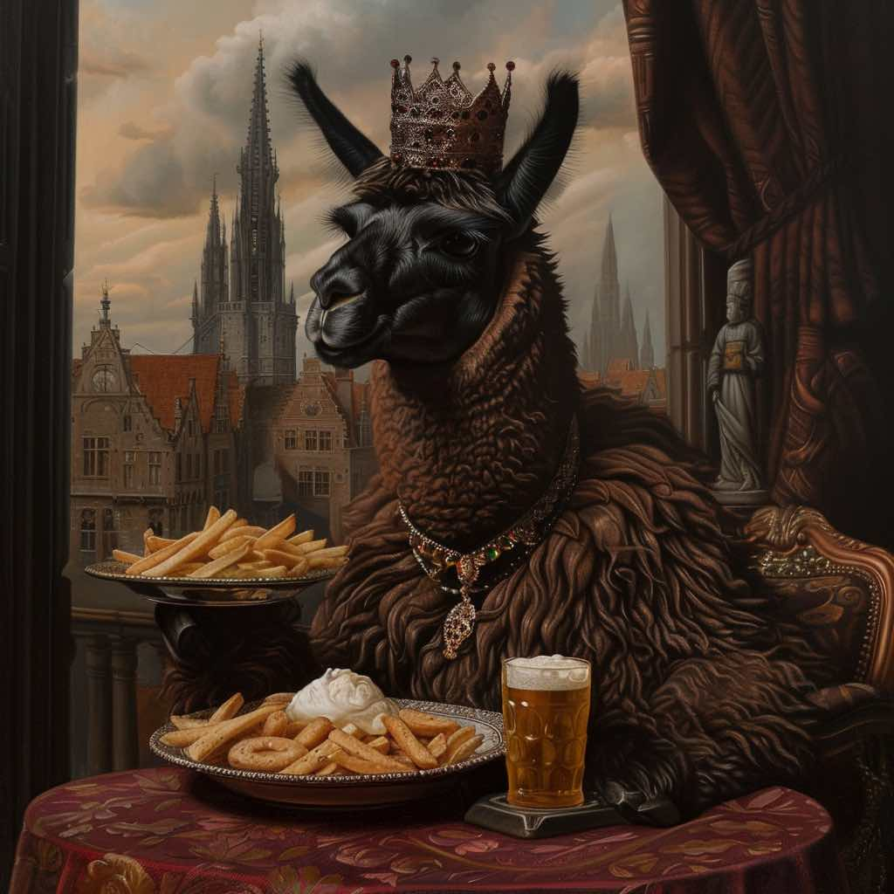

# ChocoLlama: a family of Llama models adapted to Dutch

This repository contains all code used to develop ChocoLlama, a set of Llama-2/3 based models adapted to Dutch. 

All models can be found on [Hugging Face](https://huggingface.co/ChocoLlama/) and for all details on how all 6 models have been developed and how they perform, we refer to [our paper](https://arxiv.org/pdf/2412.07633).

The code here has been largely inspired by the amazing [llama-recipes repo](https://github.com/meta-llama/llama-recipes). For the most up-to-date code to finetune Llama-based models, we recommend checking out their repo. The code we add here is mostly for transparanecy and reproducibility of the Chocollama models. 

## (1) Getting started: installing the environment

To instantiate the python environment, follow these steps:

- Create a new conda envirionment by running `conda create --name=chocollama python=3.10`
- Activate the environment by running `conda activate chocollama`
- Install CUDA 11.8 by running `conda install -c "nvidia/label/cuda-11.8.0" cuda-toolkit`
- Install llama-recipes by running `pip install --extra-index-url https://download.pytorch.org/whl/nightly/cu118 llama-recipes[vllm]`. TIP: add a cache-dir flag to avoid disk-quota-exceeded exceptions, e.g. `--cache-dir= {SOME_PATH}/.cache` (for instance needed on the login nodes of the compute infrastructure we used). 
- We need pytorch nightlies, so uninstall pytorch by running `pip uninstall torch torchvision torchaudio` and install the latest nightlies by running `pip3 install --pre torch torchvision torchaudio --index-url https://download.pytorch.org/whl/nightly/cu118`. TIP: add a cache-dir flag to avoid disk-quota-exceeded exceptions, e.g. `--cache-dir= {SOME_PATH}/.cache`. 
- Install cchardet and wandb by running `pip install cchardet wandb`
- Optimum refuses to work as of version 1.15, so we'll pin it to 1.14: `pip install optimum==1.14.1 --upgrade`
- And finally, navigate to the ChocoLlama root and run `conda develop src` (you may need to install conda-build by running `conda install conda-build`)

In order to download the pretrained models from huggingface, you might want to create an account and create an access token. You can log in by running `huggingface-cli login`.

For logging purposes, we use Weights and Biases as well as Tensorboard.
In order to log into wandb, run `wandb login` and paste your project API key when prompted.

To control where all data, models, and wandb logs are written to, update the `src/global_vars.py`. 

## (2) Data used for pretraining

We collected a diverse set of Dutch natural language. For details we refer to our paper. To download the data that is publicly available, we refer to:

1. **OSCAR**  
   The bulk of our data comes from the Dutch portion of [OSCAR](https://oscar-corpus.com), January 2023 version, based on Common Crawl. This dataset includes **93 GB** of text. To download this, use `src/data_importers/import_oscar.py`.

2. **Open Subtitles**  
   We collected Dutch text from movie subtitles, focusing on unique movies either in Dutch or with Dutch subtitles. This dataset contains **5 GB** of text (~1.54B tokens) from **214k samples**. To download this, use `src/data_importers/import_opensubtitles.py`.

3. **Project Gutenberg**  
   We downloaded **970 full Dutch books** from [Project Gutenberg](https://www.gutenberg.org) using a public scraper. The scripts used to do so can be found in `src/data_importers/download_gutenberg/`. The dataset includes **0.3 GB** of text (~92M tokens) and is available on [Hugging Face](https://huggingface.co/datasets/ChocoLlama/gutenberg-dutch).

4. **Wikipedia**  
   Using the March 2023 [Wikipedia dump](https://dumps.wikimedia.org), we included **2.5 GB** of text (~769M tokens). Despite some duplication with OSCAR, Wikipedia's high quality justifies its inclusion. To download this, use `src/data_importers/import_wikipedia.py`.

The other data sources (only minor contribution in the entire dataset) used to develop Chocollama (Job Descriptions collected partnering with TechWolf, legal filings from "Het Belgisch Staatsblad" collected parterning with Bizzy, Flemish legislation collected partnering with ML6), are unfortunately not publicly available. 

To preprocess the datasets (i.e. tokenizer and chunk in batches for pretraining), we refer to `src/data_importers/preprocess_dataset.py`. To merge all data together, we refer to `src/data_importers/get_all_data.py`. 

## (3) Getting the models

We simply download Llama models from Hugging face, potentially after signing the appropriate license. As an example see `src/model/import_llama2.py`. 

Specifically to develop **ChocoLlama-2-7B-tokentrans-base** ([link](https://huggingface.co/ChocoLlama/ChocoLlama-2-7B-tokentrans-base)), we change the tokenizer from Llama-2 to a Dutch specific tokenizer and re-initiaze the model's embeddings. For this we refer to `src/model/translate_embeddings.py` and the paper by [Remy et al.](https://arxiv.org/pdf/2408.04303). 

## (4) Continued pretraining using LoRA

First, we apply continued pretraining on the entire Dutch dataset.
To make sure you use the desired training data, update `src/llama_recipes_path/datasets` appropriately. 

Then, the main training functionality is provided in `src/llama_recipes_path/finetuning.py`. We use SLURM to submit and manage large compute jobs on the VSC infrastructure. You can find the scripts we used in `scripts/`. For instance, we launch (or resume) continued pretraining for Llama-2-7B using `sbatch scripts/llama-2-7b-LoRa.slurm`. 

As LoRa parameters we use:
- R: 8
- Alpha: 32
- Trainable modules: q_proj, v_proj, k_proj, o_proj, gate_proj, up_proj, down_proj, embed_tokens, lm_head
- LoRa dropout: 0.05

To update this see `src/llama_recipes_path/configs/peft.py`. 

For other hyperparameters used for pretraining, we refer to the paper, to the SLURM script `scripts/pretrain_chocollama2_base.slurm` and `src/llama_recipes_path/configs/training.py`.

## (5) Posttraining

After the continued pretraining on Dutch data, we instruction-tune all models as well using first SFT and then DPO. We adopt the same strategy as used to align GEITje-7B to [GEITje-7B-ultra](https://huggingface.co/BramVanroy/GEITje-7B-ultra). 
First, we apply supervised finetuning (SFT), utilizing the data made available by [Vanroy](https://arxiv.org/pdf/2312.12852):
- [BramVanroy/ultrachat_200k_dutch](https://huggingface.co/datasets/BramVanroy/ultrachat_200k_dutch)
- [BramVanroy/no_robots_dutch](https://huggingface.co/datasets/BramVanroy/no_robots_dutch)
- [BramVanroy/stackoverflow-chat-dutch](https://huggingface.co/datasets/BramVanroy/stackoverflow-chat-dutch)
- [BramVanroy/alpaca-cleaned-dutch](https://huggingface.co/datasets/BramVanroy/alpaca-cleaned-dutch)
- [BramVanroy/dolly-15k-dutch](https://huggingface.co/datasets/BramVanroy/dolly-15k-dutch)

Next, we apply Direct Preference Optimization (DPO) to the SFT version of all the pretrained models we here develop, 
now utilizing a Dutch version of the data used to train Zephyr-7B-$\beta$, [BramVanroy/ultra_feedback_dutch](https://huggingface.co/datasets/BramVanroy/ultra_feedback_dutch). 

For both the SFT and DPO stage, we update all model weights and apply the same set of hyperparameters to all models as used in GEITje-7B-ultra:
- learning_rate: 5e-07
- train_batch_size: 4
- eval_batch_size: 4
- seed: 42
- distributed_type: multi-GPU
- num_devices: 4
- gradient_accumulation_steps: 4
- total_train_batch_size: 64
- total_eval_batch_size: 16
- optimizer: Adam with betas=(0.9,0.999) and epsilon=1e-08
- lr_scheduler_type: cosine
- lr_scheduler_warmup_ratio: 0.1
- num_epochs: 1

We leverage the publicly available [alignment handbook](https://github.com/huggingface/alignment-handbook) and use a set of 4 NVIDIA A100 (80 GB) for both stages. 

## (6) Evaluation

We perform both a quantitative evaluation using benchmarks from prior work as well as a qualitative assessment using a new benchmark. 

### Quantitative evaluation

We have evaluated our models on several industry-standard Dutch benchmarks, translated from their original versions. 

To evaluate all models, we have relied on the [LM-evaluation harness repository](https://github.com/laiviet/lm-evaluation-harness), specifically [this fork](https://github.com/BramVanroy/lm-evaluation-harness).

The results can be found in the table below, together with results from several other prominent Dutch models.

| Model                                        | ARC            | HellaSwag      | MMLU           | TruthfulQA     | Avg.           |
|----------------------------------------------|----------------|----------------|----------------|----------------|----------------|
| **Llama-3-ChocoLlama-instruct**        | **0.48** | **0.66** | **0.49** | **0.49** | **0.53** |
| llama-3-8B-rebatch                           | 0.44           | 0.64           | 0.46           | 0.48           | 0.51           |
| llama-3-8B-instruct                          | 0.47           | 0.59           | 0.47           | 0.52           | 0.51           |
| llama-3-8B                                   | 0.44           | 0.64           | 0.47           | 0.45           | 0.5            |
| Reynaerde-7B-Chat                            | 0.44           | 0.62           | 0.39           | 0.52           | 0.49           |
| **Llama-3-ChocoLlama-base** | **0.45** | **0.64** | **0.44** | **0.44** | **0.49** |
| zephyr-7b-beta                               | 0.43           | 0.58           | 0.43           | 0.53           | 0.49           |
| geitje-7b-ultra                              | 0.40           | 0.66           | 0.36           | 0.49           | 0.48           |
| **ChocoLlama-2-7B-tokentrans-instruct** | **0.45** | **0.62** | **0.34** | **0.42** | **0.46** |
| mistral-7b-v0.1                              | 0.43           | 0.58           | 0.37           | 0.45           | 0.46           |
| **ChocoLlama-2-7B-tokentrans-base** | **0.42** | **0.61** | **0.32** | **0.43** | **0.45** |
| **ChocoLlama-2-7B-instruct** | **0.36** | **0.57** | **0.33** | **0.45** | **0.43 |
| **ChocoLlama-2-7B-base** | **0.35** | **0.56** | **0.31** | **0.43** | **0.41** |
| llama-2-7b-chat-hf                           | 0.36           | 0.49           | 0.33           | 0.44           | 0.41           |
| llama-2-7b-hf                                | 0.36           | 0.51           | 0.32           | 0.41           | 0.40           |

### Qualitative evaluation

In our paper, we also provide an additional qualitative evaluation of all models - which we empirically find more reliable. 

We run a side-by-side model evaluation, judged by GPT-4o, using the [FastChat repository](https://github.com/lm-sys/FastChat/tree/main). Specifically we use the instructions from its [llm-judge functionality](https://github.com/lm-sys/FastChat/tree/main/fastchat/llm_judge) to first generate model answers for each model, and then use GPT-4o as a judge to compare model answers side-by-side. 

As questions we use our benchmark [ChocoLlama-Bench](https://huggingface.co/datasets/ChocoLlama/ChocoLlama-Bench). As judgement prompts we use `qual_evaluation/chocollama_judge_prompts.jsonl`. We also provide all answers generated by Dutch models used for benchmarking in `qual_evaluation/model_answer/`. 

For results regarding the qualititative evaluation, we refer to the paper. 

## References

ChocoLlama models were developed mainly by [Matthieu Meeus](https://github.com/matthieumeeus) and [Anthony Rathé](https://github.com/anthonyrathe), supported by the other authors on [the paper](some_url) and advisors mentioned in its Acknowledgments section. 

This project has been made possible through a Tier-1 compute grant from [Vlaams Supercomputer Centrum](https://www.vscentrum.be/) (grant of apx. 40K GPU hours (NVIDIA A100-80GB)). 

If you found this repository useful for your research, kindly cite [our paper on ArXiv](https://arxiv.org/pdf/2412.07633). 

